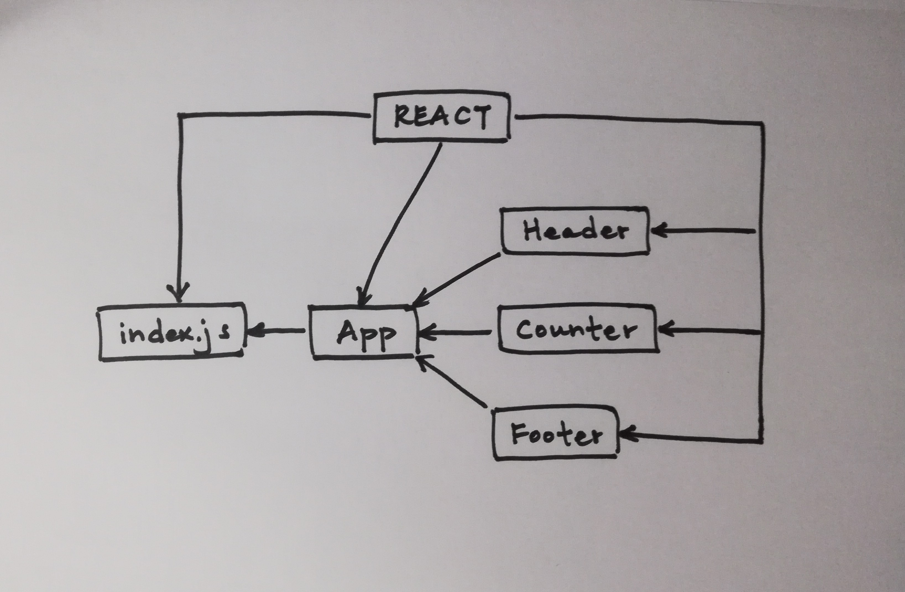

 LAB 27
=================================================

## React Testing and Deployment

### Author: Katherine Smith

### Links and Resources
* [Repository](https://github.com/ksmith10309/lab-27)
* [CodeSandbox](https://codesandbox.io/s/github/ksmith10309/lab-27)
* [AWS Deployment 1](http://lab-27-katherine.s3-website-us-west-2.amazonaws.com)
* [AWS Deployment 2](http://lab-27-app-deploybucket-1734a32hmy40r.s3-website-us-west-2.amazonaws.com)

### Modules
#### `app.js`
- Renders the Header component from header.js
- Renders the Counter component from counter.js
- Renders the Footer component from footer.js

#### `header.js`
- Contains and exports the Header component
- Renders the header

#### `counter.js`
- Contains and exports the Counter component
- Contains the updateCounter method to handle setting the count state and the polarity state after click event
- Contains the handleUp method to handle click on plus sign by invoking the updateCounter method
with the current count state plus 1
- Contains the handleDown method to handle click on minus sign by invoking the updateCounter method with the current count state minus 1
- Renders the counter

#### `footer.js`
- Contains and exports the Footer component
- Renders the footer

### Tests
* Tests are run in CodeSandBox
* The assertion that the Counter is alive at application start was made
* The assertion that the count state changes on Up event was made
* The assertion that the count state changes on Down event was made
* The assertion that the polarity state changes on Up event was made
* The assertion that the polarity state changes on Down event was made
* The assertion that the state is transferred to the DOM on Up event was made
* The assertion that the state is transferred to the DOM on Down event was made

### UML
